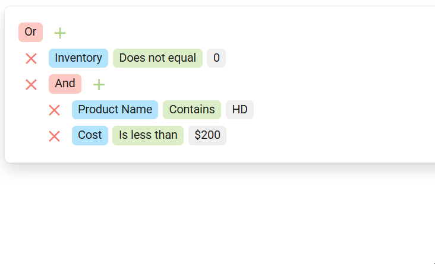

<!-- default badges list -->

[](https://supportcenter.devexpress.com/ticket/details/T1318162)
[](https://docs.devexpress.com/GeneralInformation/403183)
[](#does-this-example-address-your-development-requirementsobjectives)
<!-- default badges end -->
# DevExtreme FilterBuilder - Enable Search using FilterBuilder Field Dropdowns

This example adds search capabilities to the DevExtreme [FilterBuilder](https://js.devexpress.com/Documentation/Guide/UI_Components/FilterBuilder/Overview/) field dropdowns.



## Implementation Details 

FilterBuilder uses the DevExtreme [TreeView](https://js.devexpress.com/Documentation/Guide/UI_Components/TreeView/Overview/) component to display available field values/operations.

To determine if a TreeView instance is generated by the FilterBuilder, check if the component has a `cssClass` option (using [String.includes()](https://developer.mozilla.org/en-US/docs/Web/JavaScript/Reference/Global_Objects/String/includes)). This option is not available in standalone TreeView components. FilterBuilder adds class names to `cssClass` values as follows:
- `dx-filterbuilder-fields`: Added for the Field Values dropdown.
- `dx-filterbuilder-operations`: Added for the Operations dropdown.

Note: In the DOM, these classes are added to the wrapper element of the TreeView's parent Popup.

```JavaScript
if (treeViewInstance.option('cssClass')?.includes('dx-filterbuilder-fields')) {
    // treeViewInstance is generated by FilterBuilder
}
```

This example calls [defaultOptions(rule)](https://js.devexpress.com/Documentation/ApiReference/UI_Components/dxTreeView/Methods/#defaultOptionsrule) to add this check in the [onInitialized](https://js.devexpress.com/Documentation/ApiReference/UI_Components/dxTreeView/Configuration/#onInitialized) handler for all TreeView instances in the app. If the check returns `true`, the handler enables the TreeView's [searchEnabled](https://js.devexpress.com/Documentation/ApiReference/UI_Components/dxTreeView/Configuration/#searchEnabled) option.

To resolve scrolling issues on certain platforms, apply the following CSS styles:

```CSS
.dx-filterbuilder-overlay .dx-popup-content-scrollable > div.dx-treeview-with-search {
    max-height: 300px;
    height: auto;
}

.dx-filterbuilder-overlay div.dx-popup-content-scrollable {
    overflow: hidden;
}

.dx-filterbuilder-group-item .dx-scrollable-scroll-content {
    display: none;
}
```

## Files to Review

- **Angular**
    - [app.component.html](Angular/src/app/app.component.html)
    - [app.component.ts](Angular/src/app/app.component.ts)
    - [app.component.scss](Angular/src/app/app.component.scss)
- **React**
    - [App.tsx](React/src/App.tsx)
    - [App.css](React/src/App.css)
- **Vue**
    - [HomeContent.vue](Vue/src/components/HomeContent.vue)
- **jQuery**
    - [index.html](jQuery/src/index.html)
    - [index.js](jQuery/src/index.js)
    - [index.css](jQuery/src/index.css)
- **ASP.NET Core**    
    - [Index.cshtml](ASP.NET%20Core/Views/Home/Index.cshtml)
    - [Site.css](ASP.NET%20Core/wwwroot/css/Site.css)

## Documentation

- [FilterBuilder Overview](https://js.devexpress.com/Documentation/Guide/UI_Components/FilterBuilder/Overview/)
- [TreeView.defaultOptions(rule)](https://js.devexpress.com/Documentation/ApiReference/UI_Components/dxTreeView/Methods/#defaultOptionsrule)
- [TreeView.searchEnabled](https://js.devexpress.com/Documentation/ApiReference/UI_Components/dxTreeView/Configuration/#searchEnabled)
- [HTML-Based Components Customization](https://js.devexpress.com/Documentation/Guide/Themes_and_Styles/HTML-Based_Components_Customization/)

<!-- feedback -->
## Does This Example Address Your Development Requirements/Objectives?

[](https://www.devexpress.com/support/examples/survey.xml?utm_source=github&utm_campaign=devextreme-filterbuilder-enable-search-for-fields-dropdown&~~~was_helpful=yes) [](https://www.devexpress.com/support/examples/survey.xml?utm_source=github&utm_campaign=devextreme-filterbuilder-enable-search-for-fields-dropdown&~~~was_helpful=no)

(you will be redirected to DevExpress.com to submit your response)
<!-- feedback end -->
